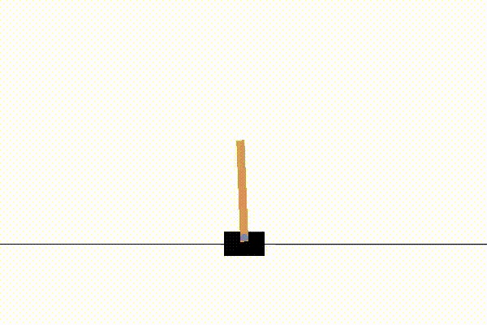
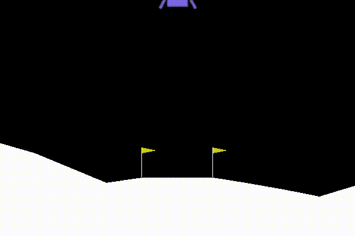
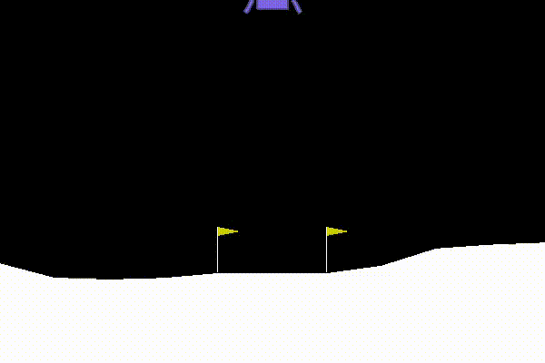
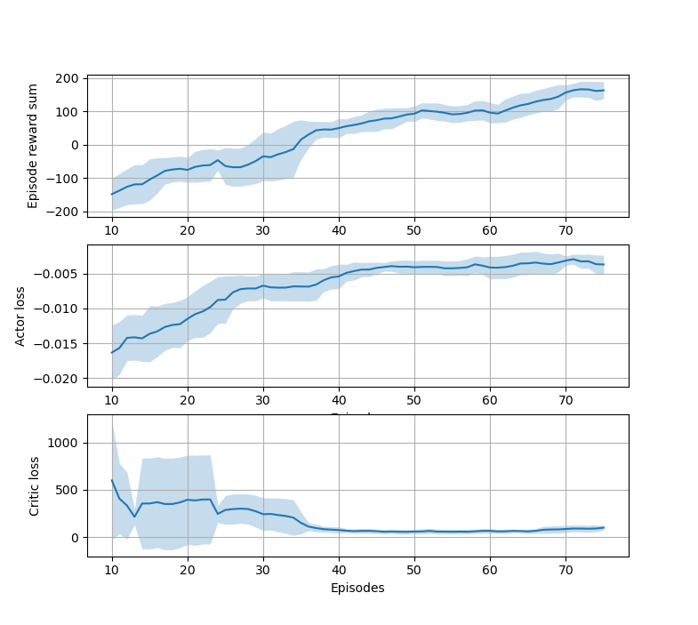

# Reinforceflow
Implementing basic RL algorithms usingTensorflow 2.x mainly for self education. 
My goal is to implement Proximal Policy Optimisation ([Schulman et al.](https://arxiv.org/abs/1707.06347)) by first implementing simpler policy gradient algorithms,
then work towrads a more complete implementation of PPO.

The algoritm (versions) implemented are: 

- [x] Policy Gradient (REINFORCE)
- [x] Actor Critic
- [x] PPO with clipping loss function
- [ ] PPO with KL divergence loss function

Fatures of the "library" (including plans):
- [x] Tensorboard logging
- [x] Custom training history plot
- [ ] Model saving and loading
- [ ] Store training artifacts in the same folder (Tensorboard logs, videos, saved models, etc.) 

## Installation
Requred packages could be installed using `conda` and the included `environment.yml` file.

```conda env create -f environment.yml```

## Train agents 
Agents are tested on the artPole-v1, LunarLanderContinuous-v2 and LunarLander-v2 gym environments, 
trainign scripts for these are included in the [experiments](experiments) folder.

```python3 -m experiments.fit_PPO_CartPole.py```

## Demonstration of trained agents
| CartPole-v1 | LunarLanderContinuous-v2 | LunarLander-v2
| :---------: | :----------------------: | :--------------: 
|  |  | 
| 50k timesteps | 250k timesteps | 200k timesteps

Example training history


